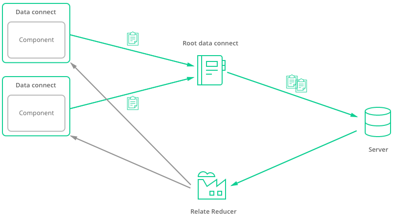

Relate has three main parts:

* **Data connect** - an extension of the React Redux connect(), and serve to declare your container's data needs.
* **Root data connect** - responsible for gathering every data connect's data needs and bundle them to query the server.
* **Relate reducer** - a Redux reducer which handles the incoming data and provides each data connect the data they asked for.

Here's a small illustration of how it works:



Relate is agnostic to your data schema. For this to work Relate presumes your schema models have an ID associated, it will search data received from requests and check for nodes which have an ID associated. For example, when receiving the following data from a query:

```js
{
  pages: [
    {
      _id: 'a',
      title: 'A',
      user: {
        _id: 'user',
        username: 'User'
      }
    },
    {
      _id: 'b',
      title: 'B'
    }
  ],
  page: {
    _id: 'c',
    title: 'C'
  },
  pagesAnotherWay: {
    items: [
      {
        _id: 'b',
        title: 'B'
      },
      {
        _id: 'd',
        title: 'D'
      }
    ],
    pagesCount: 2
  }
}
```

Relate will check which nodes comes in the request and normalize them into a private store. Following the above example the store will have the following:

```js
{
  a: {
    _id: 'a',
    title: 'A',
    user: Link('user')
  },
  user: {
    _id: 'user',
    username: 'User'
  },
  b: {
    _id: 'b',
    title: 'B'
  },
  c: {
    _id: 'c',
    title: 'C'
  },
  d: {
    _id: 'd',
    title: 'D'
  }
}
```

Note how even nested structures are normalized into the store. This allows to perform mutations on the `user` and page with ID 'a' will also be updated. Pretty neat!

Relate will also store in what we call the connectors store a representation of what each connector requested. This data is then matched with the store data and calculated into the Redux reducer, `dataConnect` will be listening for his data as you do in a regular React Redux connect().

So, for example, if your component specifies that it needs:

```js
query {
  pages {
    _id,
    title,
    user {
      _id,
      username
    }
  }
}
```

Presuming the response from the server would be:

```js
{
  pages: [
    {
      _id: 'a',
      title: 'Page A',
      user: {
        _id: 'userx',
        username: 'User X'
      }
    },
    {
      _id: 'b',
      title: 'Page B',
      user: {
        _id: 'usery',
        username: 'User Y'
      }
    }
  ]
}
```

Relate would save in store these nodes:

```js
{
  a: {
    _id: 'a',
    title: 'Page A',
    user: Link('userx')
  },
  b: {
    _id: 'b',
    title: 'Page B',
    user: Link('usery')
  },
  userx: {
    _id: 'userx',
    username: 'User X'
  },
  usery: {
    _id: 'usery',
    username: 'User Y'
  }
}
```

It would also save your connectors's requested data and what it needs from the store, Relate saves it in a structure like this:

```js
{
  data: {
    pages: ['a', 'b']
  },
  listens: {
    pages: ['a', 'b', 'userx', 'usery']
  }
}
```

When calculating the reducer state it will calculate the data each connector that needs to update from the store state. The connector listens for any change on the nodes it uses.
